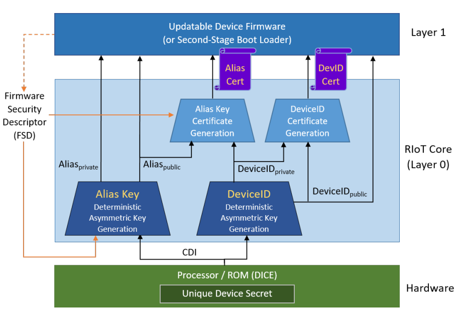
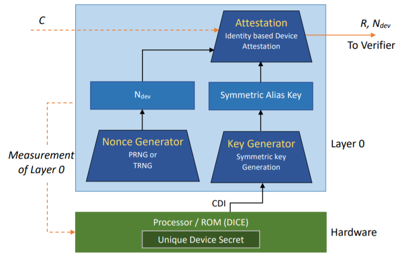
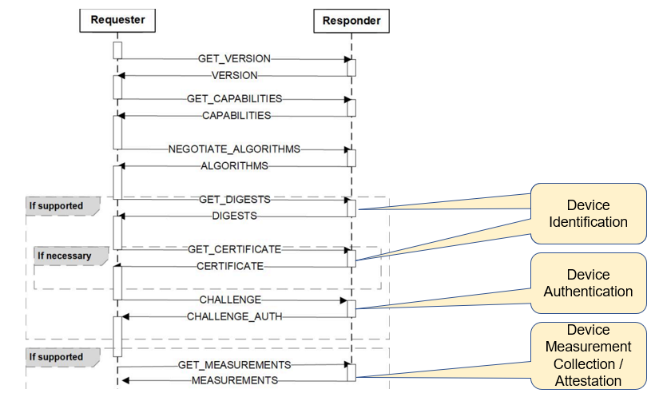

<!--- @file
  Understanding the Trusted Boot Chain Implementation

  Copyright (c) 2020, Intel Corporation. All rights reserved. 

  Redistribution and use in source (original document form) and 'compiled'
  forms (converted to PDF, epub, HTML and other formats) with or without
  modification, are permitted provided that the following conditions are met:

  1) Redistributions of source code (original document form) must retain the
     above copyright notice, this list of conditions and the following
     disclaimer as the first lines of this file unmodified.

  2) Redistributions in compiled form (transformed to other DTDs, converted to
     PDF, epub, HTML and other formats) must reproduce the above copyright
     notice, this list of conditions and the following disclaimer in the
     documentation and/or other materials provided with the distribution.

  THIS DOCUMENTATION IS PROVIDED BY TIANOCORE PROJECT "AS IS" AND ANY EXPRESS OR
  IMPLIED WARRANTIES, INCLUDING, BUT NOT LIMITED TO, THE IMPLIED WARRANTIES OF
  MERCHANTABILITY AND FITNESS FOR A PARTICULAR PURPOSE ARE DISCLAIMED. IN NO
  EVENT SHALL TIANOCORE PROJECT  BE LIABLE FOR ANY DIRECT, INDIRECT, INCIDENTAL,
  SPECIAL, EXEMPLARY, OR CONSEQUENTIAL DAMAGES (INCLUDING, BUT NOT LIMITED TO,
  PROCUREMENT OF SUBSTITUTE GOODS OR SERVICES; LOSS OF USE, DATA, OR PROFITS;
  OR BUSINESS INTERRUPTION) HOWEVER CAUSED AND ON ANY THEORY OF LIABILITY,
  WHETHER IN CONTRACT, STRICT LIABILITY, OR TORT (INCLUDING NEGLIGENCE OR
  OTHERWISE) ARISING IN ANY WAY OUT OF THE USE OF THIS DOCUMENTATION, EVEN IF
  ADVISED OF THE POSSIBILITY OF SUCH DAMAGE.

-->

Looking Forward
===============

In trusted boot, the goal of the measurement is to support attestation
later. The TPM implements the root of trust for storage (RTS) and the
root of trust for reporting (RTR). The root of trust for measurement
(RTM) can be implemented in static RTM (SRTM) or dynamic RTM (DRTM).
From a platform perspective, there are other ways to implement the
measurement and attestation.

Platform Root of Trust - Cerberus
---------------------------------

A platform root of trust (RoT) is an entity to authenticate the firmware
on the platform. One example is the OCP Project
[Cerberus](https://github.com/opencomputeproject/Project_Olympus/blob/master/Project_Cerberus).
The platform RoT may also collect measurements from the devices and
support remote attestation. Figure 14 shows the concept of platform RoT.

{width="6.492361111111111in"
height="4.0in"}

Figure 14. Platform Root of Trust

Device Root of Trust - DICE
---------------------------

A device root of trust (RoT) is the RoT for a specific device to verify
the mutable firmware and report the measurement. TCG defines the Device
Identifier Composition Engine (DICE) architecture for embedded devices
which do not have full TPM capability but still want to support
attestation. DICE uses a layering architecture. A layered TCB
architecture uses a constrained set of TCB capabilities to construct the
next TCB layer. Figure 15 shows the DICE asymmetric attestation
architecture. Similar to the TPM certificate, a DICE device can present
a DICE certificate as the identity for the device. Figure 16 shows the
DICE symmetric attestation architecture, which may be used in a resource
constrain environment. For more detail, please refer to [TCG DICE
architecture](https://trustedcomputinggroup.org/work-groups/dice-architectures/).

{width="6.426221566054243in"
height="4.378205380577428in"}

Figure 15. DICE implicit identity based attestation (source: [DICE
Identity](https://trustedcomputinggroup.org/resource/implicit-identity-based-device-attestation/))

{width="6.0641021434820646in"
height="3.872992125984252in"}

Figure 16. DICE symmetric identity based attestation (source: [DICE
symmetric
Identity](https://trustedcomputinggroup.org/resource/symmetric-identity-based-device-attestation/))

Server Management Domain Firmware
---------------------------------

A server management domain (such as Baseboard Management Controller,
also known as BMC) may have its own TPM module and SRTM because of its
isolated execution environment. Table 8 shows the TPM PCR usage in a
server management domain. For more details, please refer to [TCG Server
Management Domain Firmware
Specification](https://trustedcomputinggroup.org/wp-content/uploads/TCG_ServerManagementDomainFirmwareProfile_v1p00_11aug2020.pdf).

Table 8: TPM PCR Usage in Management Domain (Source: [TCG
Server](https://trustedcomputinggroup.org/wp-content/uploads/TCG_ServerManagementDomainFirmwareProfile_v1p00_11aug2020.pdf))

  **PCR Index**   **PCR Usage**
  --------------- ----------------------------------------
  0               SRTM and Boot Loader
  1               Management Domain Configuration
  2               Loadable Devices
  3               Loadable Devices Configuration
  4               Reserved for future
  5               Reserved for future
  6               Vendor Specific
  7               Reserved for future
  8               For management domain OS
  9               For management domain OS configuration
  10\~15          Reserved for future
  16              Debug
  17\~23          Reserved for future

Secure communication -- SPDM
----------------------------

Now we have multiple device entities on the platform. We need a secure
communication mechanism. The Desktop Management Taskforce (DMTF) Secure
Protocol and Data Model (SPDM) serves that purpose. SPDM defines message
formats, data objects, and sequences for performing message exchanges.
The protocols defined by SPDM can be used for a wide range of security
functions. The SPDM protocol is similar to the network Transport Layer
Security (TLS) protocol, but it is customized for the communication
between two device entities.

SPDM 1.0 defines messages for hardware and firmware identification and
authentication, including messages for hardware and firmware measurement
collection and attestation. See Figure 4-3A. SPDM 1.1 defines a secure
session establishment mechanism between two entities by using Diffie
Hellman ephemeral (DHE) or Elliptic Curve DHE (ECDHE) key exchange with
asymmetric authentication such as RSA or Elliptic Curve Digital
Signature Algorithm (ECDSA). For a device that only supports symmetric
cryptography, the secure session can also be established with a
pre-shared key (PSK). Once the session is created, two entities can use
Authentication Encryption and Associated Data (AEAD) for message
communication. See Figure 4-3B. For more detail, please refer to [DMTF
SPDM
Specification](https://www.dmtf.org/sites/default/files/standards/documents/DSP0274_1.1.0.pdf).

{width="6.5in"
height="3.9166666666666665in"}

Figure 17. SPDM 1.0 (source:
[SPDM](https://www.dmtf.org/sites/default/files/standards/documents/DSP0274_1.1.0.pdf))

{width="6.5in"
height="2.6666666666666665in"}

Figure 18. SPDM 1.1 (source:
[SPDM](https://www.dmtf.org/sites/default/files/standards/documents/DSP0274_1.1.0.pdf))

Currently [openspdm](https://github.com/jyao1/openspdm) project provides
an open source tool to validate the SPDM implementation and some sample
code for explaining the SPDM concept. Figure 4-4 shows the openspdm
internal design.

{width="6.5in"
height="2.954861111111111in"}

Figure 19. openspdm design (Source: [openspdm
doc](https://github.com/jyao1/openspdm/blob/master/Doc/Design.md))

An Open Trusted Platform -- Putting it all together
---------------------------------------------------

To put all of the above technology together, Figure 4-5 shows an example
of an open trusted platform.

{width="6.5in"
height="4.166666666666667in"}

Figure 20. An Open Trusted Platform
